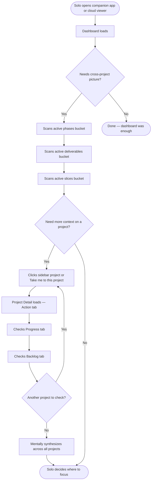

# As-Is Process Map — Cross-Project Portfolio Orientation
**Feature:** Board View
**Date:** 2026-05-05

---



---

## Notes

- The dashboard buckets (phases, deliverables, slices) show active items but are not grouped by stage — the solo can't see at a glance what's in design vs. in build vs. in test across projects.
- Cross-project synthesis is entirely manual — the solo navigates project by project and builds the picture in their head.
- Each project requires at least 2–3 tab visits to understand its full state.
- The cloud viewer has the same limitation — project-by-project navigation, no portfolio stage view.
```
