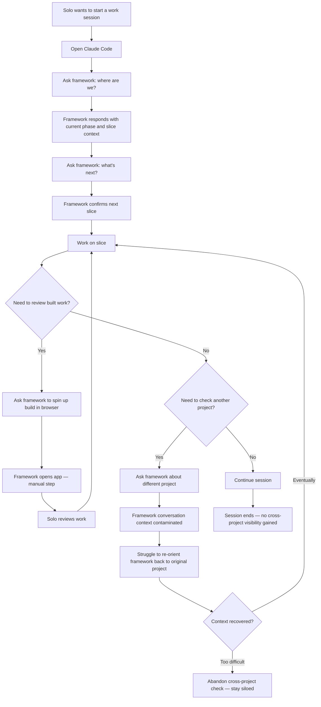

# As-Is Process — Project Orientation & Status Awareness
**Date:** 2026-04-28
**Status:** Validated



## Key observations

- **Orientation is fully conversational.** Every piece of context — current phase, next slice, how this fits the deliverable — must be pulled through Claude Code by asking for it. There is no ambient view.
- **Cross-project visibility has a context cost.** Asking the framework about a different project pulls the conversation in a new direction. Getting back to the original project focus requires effort — often enough effort that solos avoid it entirely.
- **Build review is manual and prompted.** The solo must ask the framework to spin up the build. It is not automatic on slice completion.
- **Serial work is enforced by friction.** The tracking difficulty of even one project makes running multiple concurrent projects impractical. Solos work on one project at a time.
- **No end-of-session summary across projects.** When a session ends, there is no way to see progress across all projects without starting new conversations with the framework.
```
