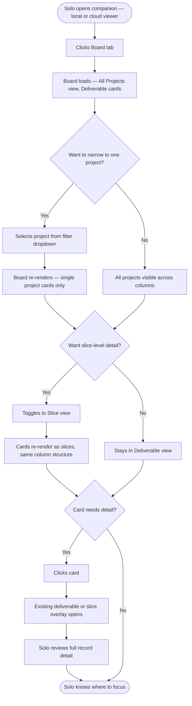

# To-Be Process Map — Cross-Project Portfolio Orientation
**Feature:** Board View
**Date:** 2026-05-05

---

---

## Kanban Column Structure

| Column | What lives here |
|---|---|
| Design Sprint | Deliverables/slices with status In Review |
| Planning | Deliverables/slices with status Planning, Ready, or Upcoming |
| In Build | Deliverables/slices with status In Build or In QA |
| In Test | Deliverables/slices with status In Test |

Active work only — Done deliverables and slices do not appear on the board.

---

## Card Content

**Deliverable card:** deliverable name · project name (All Projects view) · slice count · status breakdown (how many slices in each state)

**Slice card:** slice ID · slice name · deliverable name · project name (All Projects view) · status badge

---

## Decision Points

- **All Projects / Single Project** — filter dropdown, defaults to All Projects on load
- **Deliverable / Slice toggle** — segmented control, defaults to Deliverable view
- **Card click** — opens existing overlay (reuses SL-011 for slices, SL-012 for deliverables)

---

## Notes

- Board available in both local companion and cloud viewer (Cloudflare) — same parity model as existing tabs.
- Framework skill changes (parallel pipeline mode, handoff.md Pipeline mode field) are a separate curator track — not part of this build.
