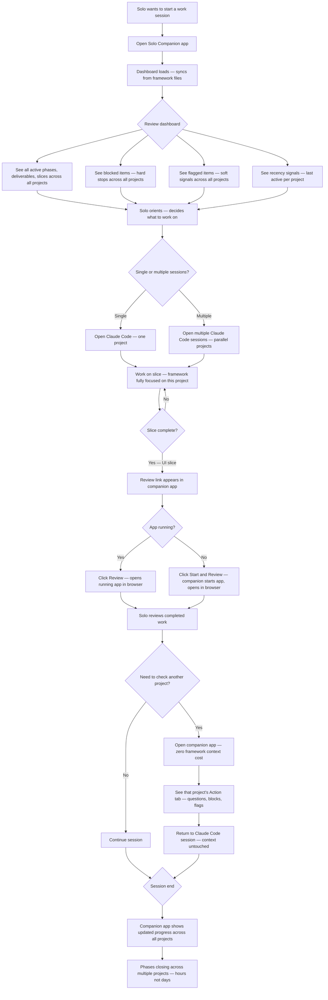

# To-Be Process — Project Orientation & Status Awareness
**Date:** 2026-04-28
**Status:** Agreed — process contract

## Process contract

Every step in this map is what we are building. Screens in the design sprint must trace to steps here. Slices in the backlog must implement steps here. Anything that does not trace to this map is a scope decision — not a silent addition.

## Key improvements over as-is

- **Orientation is ambient.** The solo sees project state without asking for it. No conversational overhead.
- **Cross-project visibility has zero context cost.** Checking another project means opening the companion app — the framework conversation is never touched.
- **Build review is one click.** Review links surface automatically on slice completion. No asking, no manual spin-up.
- **Parallel builds are now practical.** With ambient cross-project tracking, the solo can run multiple concurrent framework sessions without losing the thread on any project.
- **Phases close faster.** Parallel work across projects compresses time-to-phase-completion from days to hours.
- **Tokens freed for building.** Every orientation question asked of the framework consumes context window tokens. Those tokens are spent on overhead, not building. The companion app eliminates that overhead — tokens that previously went to "where are we" and "what's next" are now available for actual build work. Sessions run longer, context pressure is lower, and more gets built per session.

## Steps by screen (to be annotated after design sprint)

| Step | Screen | Slice |
|------|--------|-------|
| Dashboard loads | — | — |
| Active work buckets | — | — |
| Blocked / flagged section | — | — |
| Project detail — Action tab | — | — |
| Project detail — Progress tab | — | — |
| Project detail — Materials tab | — | — |
| Project detail — Decisions & Changes tab | — | — |
| Review link / Start & Review | — | — |
| Activity feed | — | — |
